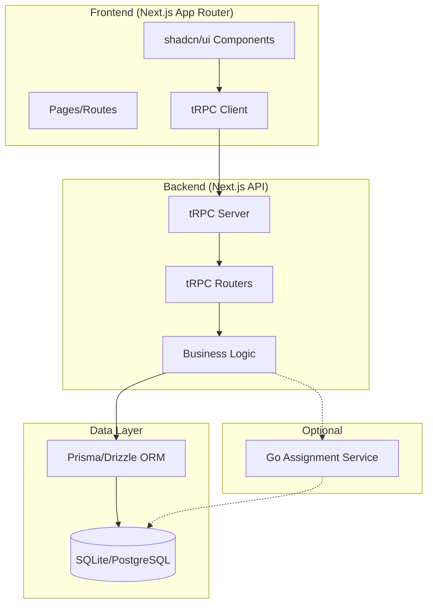
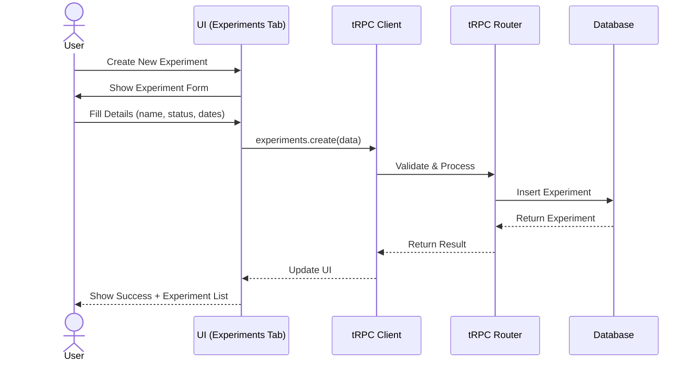
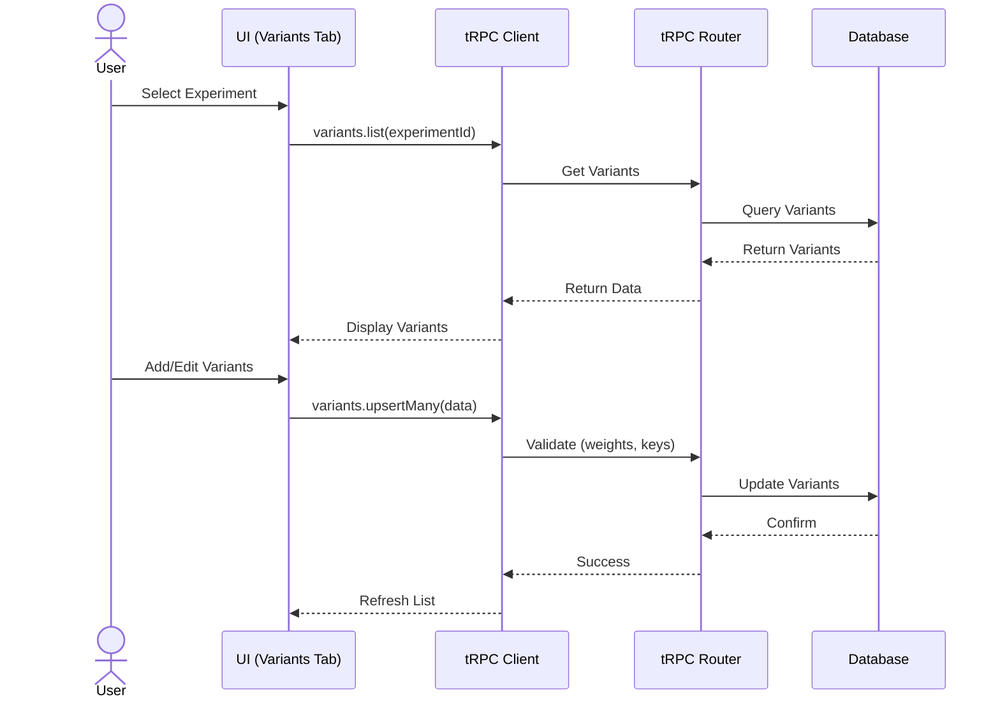
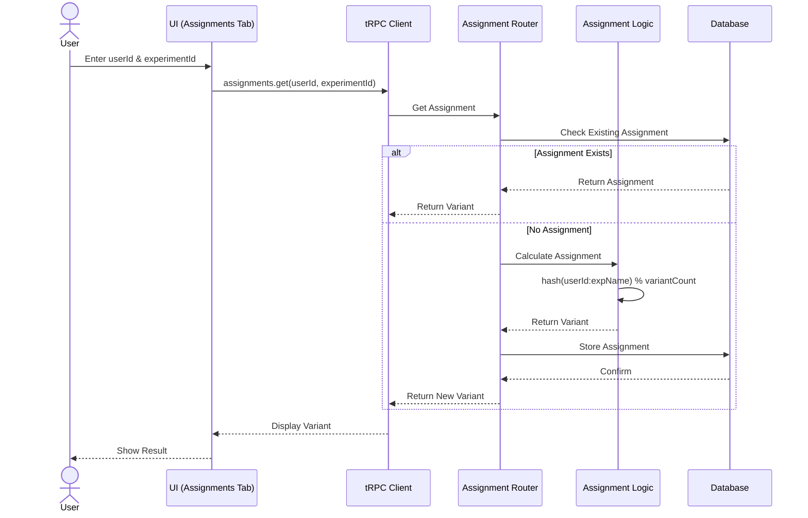
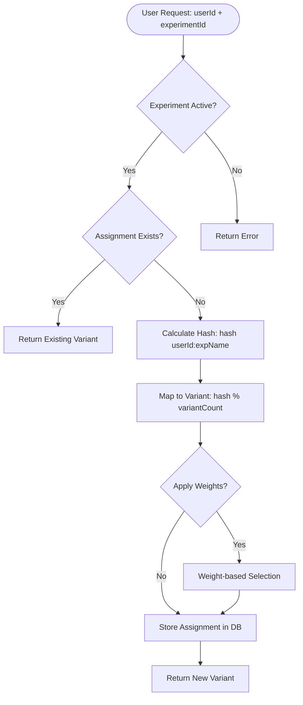
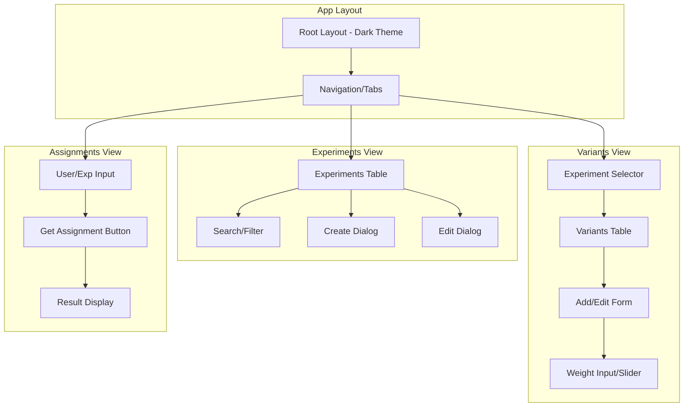
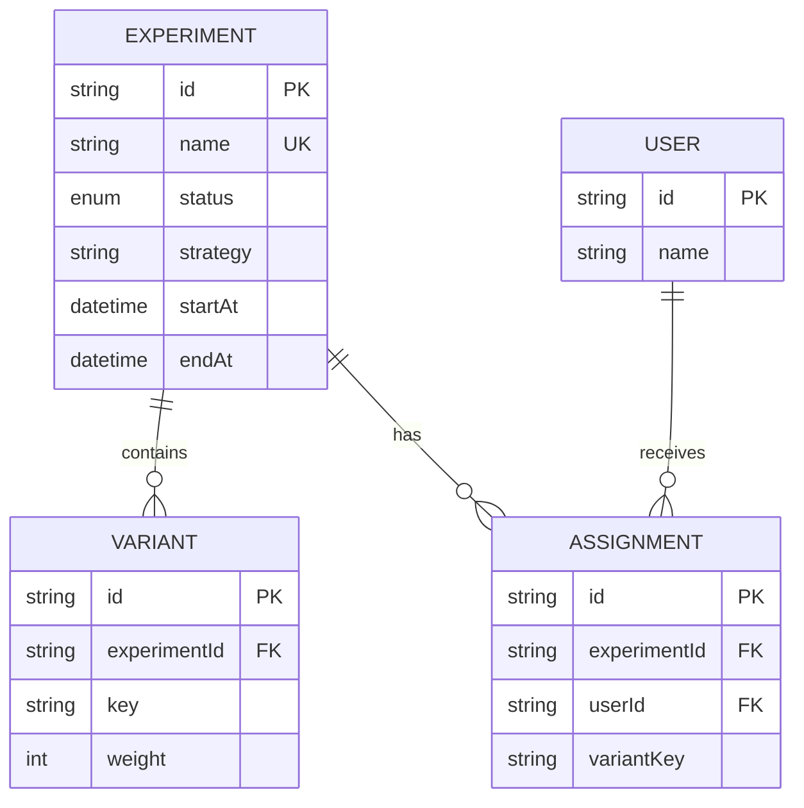
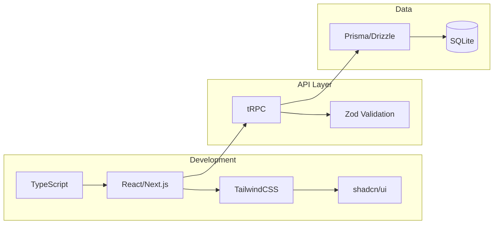
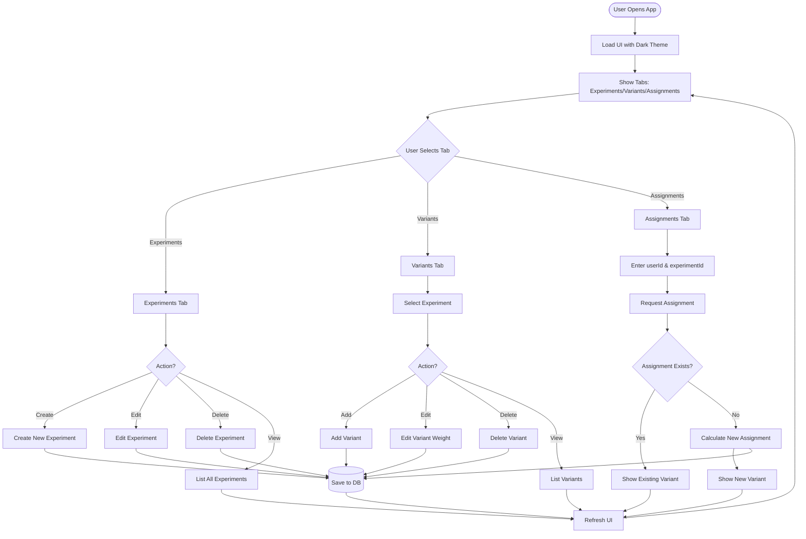
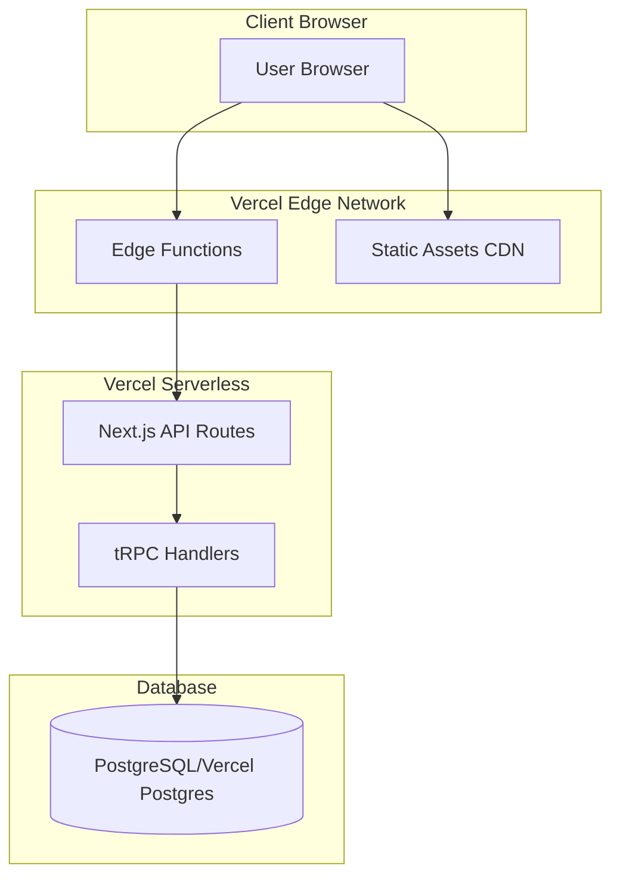

# A/B Testing Platform - Architecture & Flow Diagrams

## System Architecture

## User Flow - Experiment Management

## User Flow - Variant Management

## User Flow - Assignment (Sticky)

## Assignment Logic Flow (Detailed)

## Component Structure

## Data Model Relationships

## Technology Stack Flow

## Complete Application Flow

## Deployment Architecture (Optional - Vercel)

## Quick Reference: Key Interactions

### Creating an Experiment

1. User fills form with experiment details
2. Frontend validates input (Zod schema)
3. tRPC client calls `experiments.create`
4. Backend validates and saves to database
5. UI refreshes with new experiment in list

### Assigning a User to Variant

1. User enters userId and experimentId
2. System checks for existing assignment
3. If none exists:
   - Calculate hash from userId and experiment name
   - Map hash to variant index
   - Save assignment to database
4. Return variant key to user

### Managing Variants

1. User selects an experiment
2. System loads variants for that experiment
3. User can add/edit/delete variants
4. System validates weights (must total to logical distribution)
5. Changes saved and UI refreshes

---

**Note:** These diagrams provide a visual reference for understanding the system architecture, data flow, and user interactions. Refer to REQUIREMENTS.md for detailed specifications.
